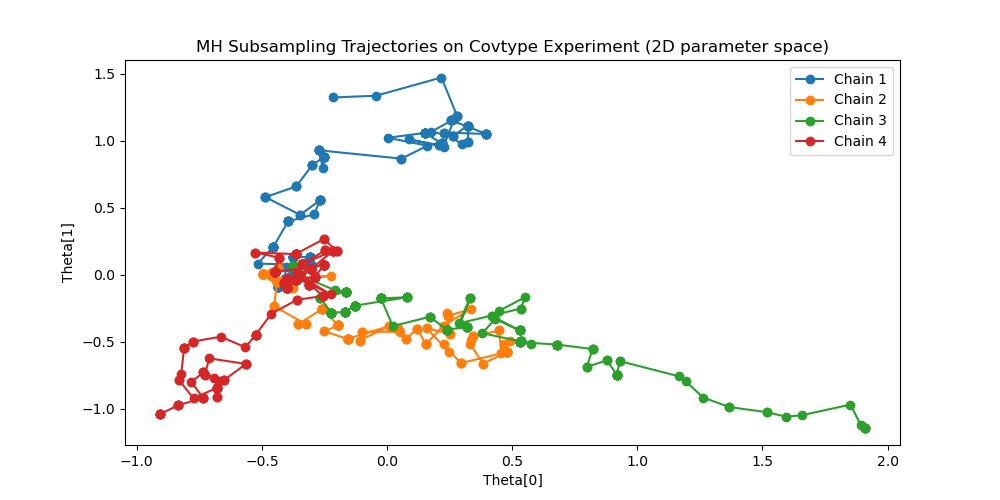
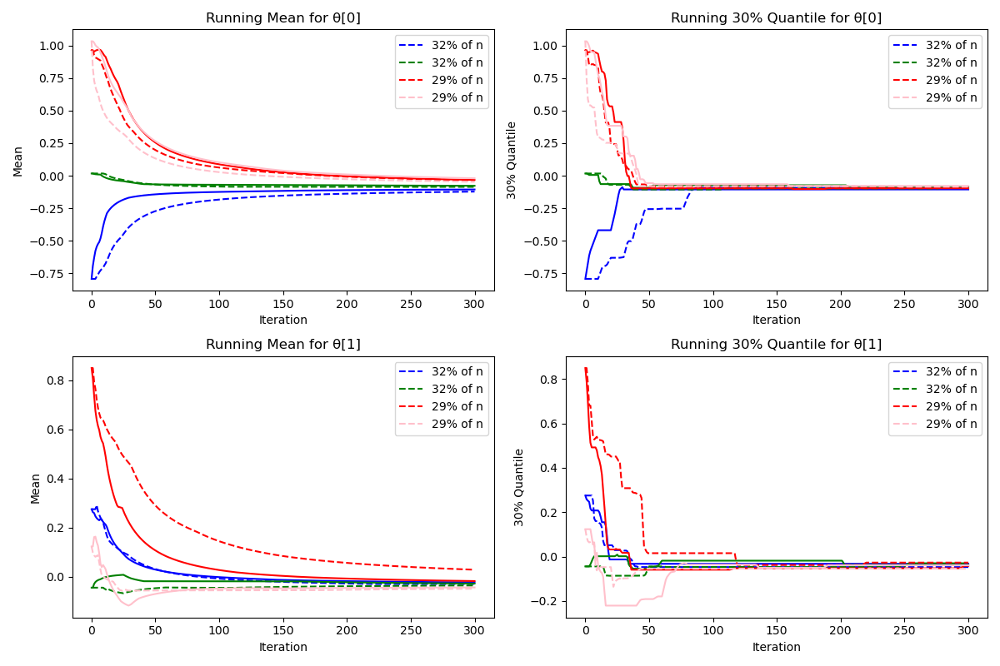
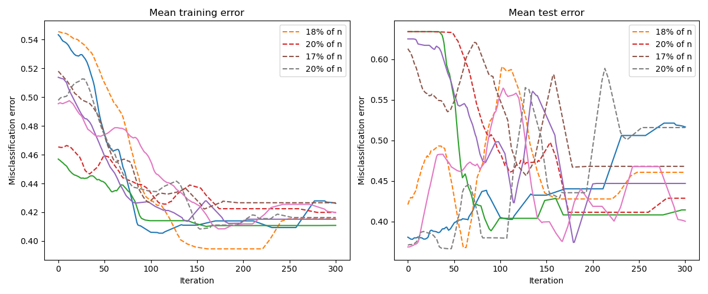
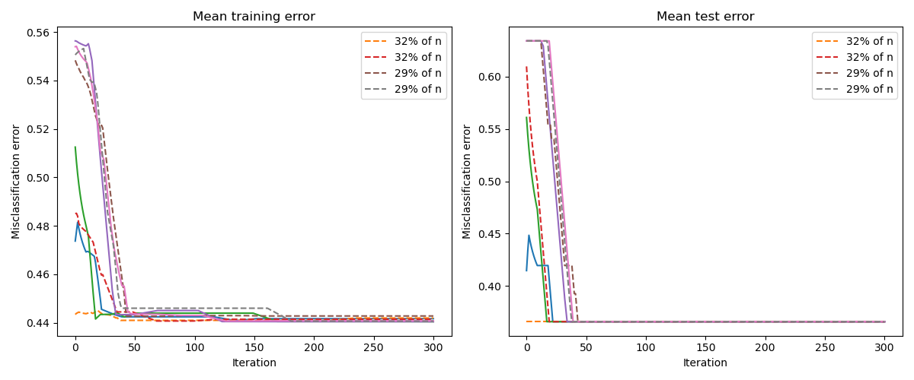

# Adaptive Subsampling for Metropolis–Hastings

A from-scratch, vectorized NumPy reimplementation of the adaptive-subsampling
Metropolis–Hastings sampler of **Bardenet, Doucet & Holmes**,
*Towards Scaling Up Markov Chain Monte Carlo: An Adaptive Subsampling Approach*
(ICML 2014). The repository provides the exact Metropolis–Hastings (MH) sampler,
its subsampling variant (`MHSubLhd`), a large-scale Bayesian logistic-regression
experiment on the *covtype* dataset, and a short empirical study that highlights
a subtlety in the confidence-interval argument underlying the method.

---

## 1. Motivation

In a Bayesian setting with data $x_1,\dots,x_n$ conditionally i.i.d. given a
parameter $\theta$, one targets the posterior
$\pi(\theta)\propto p(\theta)\prod_{i=1}^{n} p(x_i\mid\theta)$.
A standard Metropolis–Hastings step proposes $\theta'\sim q(\cdot\mid\theta)$ and
accepts it with the usual ratio. Writing the accept/reject test in log form, the
candidate is accepted if and only if

$$
\Lambda_n(\theta,\theta') \;>\; \psi(u,\theta,\theta'),
\qquad
\Lambda_n(\theta,\theta') = \frac{1}{n}\sum_{i=1}^{n}\log\frac{p(x_i\mid\theta')}{p(x_i\mid\theta)},
$$

where $\psi$ collects the prior/proposal terms and the uniform draw
$u\sim\mathcal{U}_{(0,1)}$. The difficulty is that evaluating $\Lambda_n$ requires
a **full pass over the whole dataset at every iteration**, which is prohibitive
when $n$ is large.

## 2. Method

The subsampling sampler replaces the full average $\Lambda_n$ by a Monte Carlo
estimate computed on a subset of the data drawn **without replacement**,
and decides whether the acceptance test $\Lambda_n>\psi$ holds **without looking at
all the data**. The estimate is surrounded by a concentration bound: for a tolerance
level $\delta_t$,

$$
\mathbb{P}\big(|\Lambda_t^{*}-\Lambda_n|\le c_t\big)\ge 1-\delta_t,
\qquad
c_t = 2\,C_{\theta,\theta'}\sqrt{\frac{2\big(1-\tfrac{t-1}{n}\big)\log(2/\delta_t)}{2t}},
$$

a Hoeffding–Serfling bound for sampling without replacement, with
$C_{\theta,\theta'}$ a per-step constant bounding the range of the individual
log-likelihood ratios. As soon as the estimate lies farther than $c_t$ from the
threshold, i.e. $|\Lambda_t^{*}-\psi|>c_t$, the sign of $\Lambda_n-\psi$ can be read
off safely and the step is decided. Otherwise the subsample is enlarged
geometrically, $b\leftarrow\lceil\gamma t\rceil$, the tolerance $\delta_t$ is
shrunk, and the test is re-checked. A union bound over the successive looks keeps
the overall probability of a wrong decision below a user-specified budget $\delta$,
so the resulting chain is a controlled approximation of the exact MH chain while,
in favourable regimes, touching only a fraction of the data per iteration.

## 3. Repository structure

| File | Description |
|------|-------------|
| `MH_algorithm.py` | Core library: the exact MH sampler, the adaptive-subsampling sampler, and the helper that builds the range constant $C_{\theta,\theta'}$. |
| `covtype_test.py` | Large-scale Bayesian logistic-regression experiment on *covtype*, comparing the two samplers and producing the figures. |
| `theoretical_probability_analysis.py` | Empirical study of the marginal vs. conditional validity of the confidence bound (see §6). |
| `MH_subsampling.pdf` | Accompanying write-up. |
| `*.png` | Figures generated by the experiment. |

## 4. The scripts in detail

### `MH_algorithm.py`

The computational core. Every routine is vectorized over `m` chains
(starting points) at once, so a whole ensemble is advanced in a single call.

- **`Kernel`** — abstract proposal kernel exposing `sample(theta)` and
  `density(theta', theta)`; concrete kernels (e.g. a Gaussian random walk) subclass it.
- **`C_data(data, likelihood_function)`** — returns a closure
  $(\theta_1,\theta_2)\mapsto C_{\theta_1,\theta_2}$, the per-step constant that
  scales the concentration radius $c_t$.
- **`MH_bayesian(...)`** — the exact Metropolis–Hastings sampler. At each iteration
  it forms the log threshold $\psi$ from the prior and proposal densities, evaluates
  the full-data log-likelihood ratio $\Lambda_n$, and accepts per chain according to
  $\Lambda_n>\psi$. Returns the array of successive states.
- **`MH_bayesian_subsampling(...)`** — the `MHSubLhd` sampler. Inside each MH step a
  `while` loop grows the subsample without replacement, updates the running estimate
  $\Lambda_t^{*}$, recomputes the Hoeffding–Serfling radius $c_t$, and stops each chain
  as soon as $|\Lambda_t^{*}-\psi|>c_t$ (or the whole dataset has been consumed). A
  boolean `not_done` mask ensures that only the chains that have **not** yet met the
  stopping criterion keep drawing new data, so no computation is wasted. With
  `percentage=True` it also returns, per iteration and per chain, the fraction of the
  dataset actually used — the key efficiency diagnostic.

### `covtype_test.py`

Reproduces the paper's Bayesian logistic-regression benchmark on the *covtype*
dataset (fetched via `scikit-learn`). The multiclass target is binarised
(class 2 vs. rest), the first `q` standardized features are kept (`q=10` by
default, `q=2` for the 2-D visualizations), and roughly the first 400,000 points
are used for training with the remainder held out for testing. It defines a
Gaussian random-walk proposal, a logistic likelihood, and an independent Cauchy
prior, then runs the exact and subsampling samplers on the same four chains,
reports the wall-clock speed-up, and saves:

- the chain trajectories in the 2-D parameter space,
- the running posterior mean and 30% quantile per coordinate,
- the training/test misclassification error along the chains,

overlaying the exact sampler (solid) and the subsampling sampler (dashed), with
each dashed curve annotated by the **average fraction of the data it consumed**.

### `theoretical_probability_analysis.py`

A small, self-contained numerical experiment supporting the theoretical remark of
§6. On a fixed toy population it draws many subsamples of size `t` without
replacement and estimates, by Monte Carlo, two quantities as functions of a
threshold `a` and a tolerance `epsilon`:

- **`proba`** — the *marginal* probability that a subsample mean lands within
  `epsilon` of the full-population mean (the concentration event
  $\{|\Lambda_t^{*}-\Lambda_n|\le c_t\}$);
- **`proba_conditional`** — the *conditional* probability of the same event given
  that the subsample mean is farther than `epsilon` from `a` (the event that
  triggers the stopping rule, $\{|\Lambda_t^{*}-\psi|>c_t\}$).

It plots the two as 3-D surfaces over `(epsilon, a)`, so the discrepancy between
them can be read off directly.

## 5. Requirements & installation

Minimal dependencies (Python ≥ 3.9):

```
numpy
scipy
matplotlib
scikit-learn
```

```bash
pip install -r requirements.txt
```

`scikit-learn` is required only by `covtype_test.py`, which downloads the
*covtype* dataset on first run.

## 6. A note on the confidence-bound argument

The correctness guarantee of `MHSubLhd` rests on a concentration inequality of the
form $\mathbb{P}(|\Lambda_t^{*}-\Lambda_n|\le c_t)\ge 1-\delta_t$, which controls the
**marginal** probability that the Monte Carlo estimate stays within $c_t$ of its
full-data value. The acceptance decision, however, is not issued at a fixed $t$:
the adaptive rule keeps enlarging the subsample until the estimate lands far enough
from the threshold, i.e. until $|\Lambda_t^{*}-\psi|>c_t$, and only *then* decides.
The decision is therefore taken **conditionally on the stopping event**
$\{|\Lambda_t^{*}-\psi|>c_t\}$, and the quantity that governs the error of that
decision is the *conditional* probability
$\mathbb{P}(|\Lambda_t^{*}-\Lambda_n|\le c_t \mid |\Lambda_t^{*}-\psi|>c_t)$ — not the
marginal one that the bound provides.

`theoretical_probability_analysis.py` estimates both probabilities on a controlled
problem and shows that **they do not coincide**: conditioning on the stopping event
materially changes the probability that the estimate is close to the true value. The
gap is largest precisely in the regime that dominates the sampler's cost — when the
threshold $\psi$ sits close to the true average log-likelihood ratio $\Lambda_n$,
i.e. the "hard", near-boundary MH steps. There, the per-decision error is not
controlled at the nominal level $\delta_t$, so the marginal bound cannot be invoked
as stated to certify the decision actually taken by the algorithm. This is the
theoretical point the script makes concrete empirically.

## 7. Usage

```bash
# Large-scale logistic-regression experiment (edit q at the bottom of the file)
python covtype_test.py

# Marginal vs. conditional probability surfaces
python theoretical_probability_analysis.py
```

`MH_algorithm.py` is a library and is meant to be imported:

```python
from MH_algorithm import MH_bayesian, MH_bayesian_subsampling, C_data
```

## 8. Results

On the *covtype* logistic-regression benchmark, the subsampling chains track the
exact MH chains closely — the running posterior means and quantiles converge to the
same values, and the training/test error trajectories are comparable — while, in
these runs, evaluating on average only about **20–32% of the dataset per iteration**
(the exact figure is annotated in each legend and varies with `q` and the tuning).

**Chain trajectories in the 2-D parameter space (`q=2`)**



**Running posterior mean and 30% quantile — exact (solid) vs. subsampling (dashed)**



**Training and test error along the chains (`q=10`)**



**Training and test error along the chains (`q=2`)**



## 9. References & links

- R. Bardenet, A. Doucet, C. Holmes. *Towards Scaling Up Markov Chain Monte Carlo:
  An Adaptive Subsampling Approach.* ICML 2014.
  [proceedings.mlr.press/v32/bardenet14.html](https://proceedings.mlr.press/v32/bardenet14.html)
- Repository:
  [github.com/tizianofassina/MH_subsampling_bayesian](https://github.com/tizianofassina/MH_subsampling_bayesian.git)
